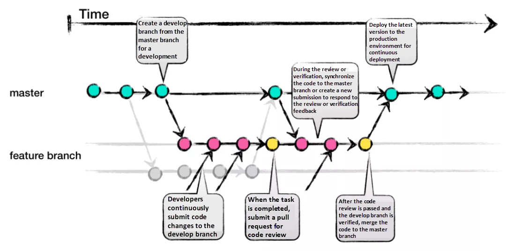

# IEUM APIs

## Flow

#### 1. Notion의 스프린트 보드에 새로운 작업을 추가합니다.
#### 2. 해당 작업에 대한 Issue를 생성하고, 담당자를 할당합니다.
#### 3. 해당하는 작업을 위한 feature 브랜치를 develop 브랜치에서 체크아웃하여 작업을 시작합니다.
  - 작업하는 기능이 명확히 드러나도록 네이밍해주세요.
    - ex) feature/oauth-instagram
#### 4. 작업 중에는 정해진 컨벤션을 따라 변경 사항을 커밋으로 저장하고 Push합니다.
  - 작업 상황을 알 수 있게 작업 중에 PR을 Draft Mode로 생성하는 것을 권장합니다.
#### 5. 작업이 완료된 브랜치는 Pull Request를 생성하여 코드 리뷰를 요청합니다.
#### 6. 코드 리뷰를 거쳐 문제가 없다면, develop 브랜치로 해당 브랜치를 병합합니다.
  - 릴리즈 버전의 경우, develop에서 main 브랜치로의 PR을 열어 최종적인 코드 리뷰를 추가로 거쳐 병합시킵니다.
#### 7. Notion에 작업의 진행 상황을 업데이트합니다.

## 커밋 컨벤션
| 제목 태그 이름 | 설명 |
| --- | --- |
| feat | 새로운 기능을 추가 |
| fix | 버그 수정 |
| style | 코드 포맷 변경, 세미 콜론 누락 등 (프로덕션 코드 변경 X) |
| refactor | 코드 리팩토링 |
| comment | 필요한 주석 추가 및 변경 |
| docs | 문서 수정 |
| test | 테스트 추가, 테스트 리팩토링 (프로덕션 코드 변경 X) |
| chore | 빌드 테스트 업데이트, 패키지 매니저를 설정하는 경우 (프로덕션 코드 변경 X) |
| rename | 파일 혹은 폴더명을 수정하거나 옮기는 작업만인 경우 |
| remove | 파일을 삭제하는 작업만 수행한 경우 |
| !BREAKING CHANGE | 커다란 API 변경의 경우 |
| !HOTFIX | 급하게 치명적인 버그를 고쳐야하는 경우 |

- 제목 이외에, 무엇을 왜 변경했는지에 관한 부연설명이 필요할 경우, 줄바꿈 뒤 본문을 작성해주세요.
- 영문과 한글 모두 상관없으나, 내용을 이해하기 쉽도록 명료하게 작성해주세요.
